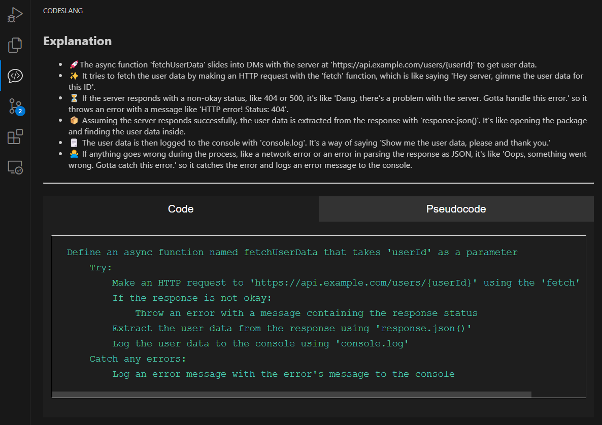
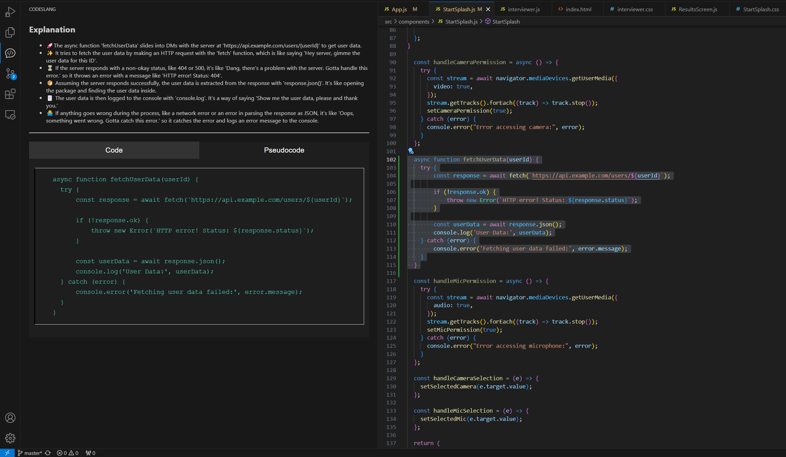

# CodeSlang

Welcome to CodeSlang, a VSCode extension designed to make understanding code easier and more fun.

In today's fast-paced tech world, grappling with complex code can be daunting. CodeSlang breaks down code into easy-to-understand explanations using modern terminology, slang, and emojis.

It's like having a tech-savvy friend explain code to you in a language you actually speak!

## Features

<div style="display: flex; justify-content: space-between;">
    <figure>
        
        <figcaption style="text-align: center;">1. Select Code</figcaption>
    </figure>

<figure>
        
        <figcaption style="text-align: center;">2. View Explanation & Pseudocode</figcaption>
    </figure>

<figure>
        
        <figcaption style="text-align: center;">Full Screen View</figcaption>
    </figure>

</div>

## Install

Search for `CodeSlang` in the VSCode Marketplace

Or install in terminal

```
code --install-extension AvinashMaheshwari-CodeSlang
```

## Known Issues

- Takes a min to generate explanation (working on making it faster)
- Sometimes throws error when parsing explanation

##

**Enjoy!**
